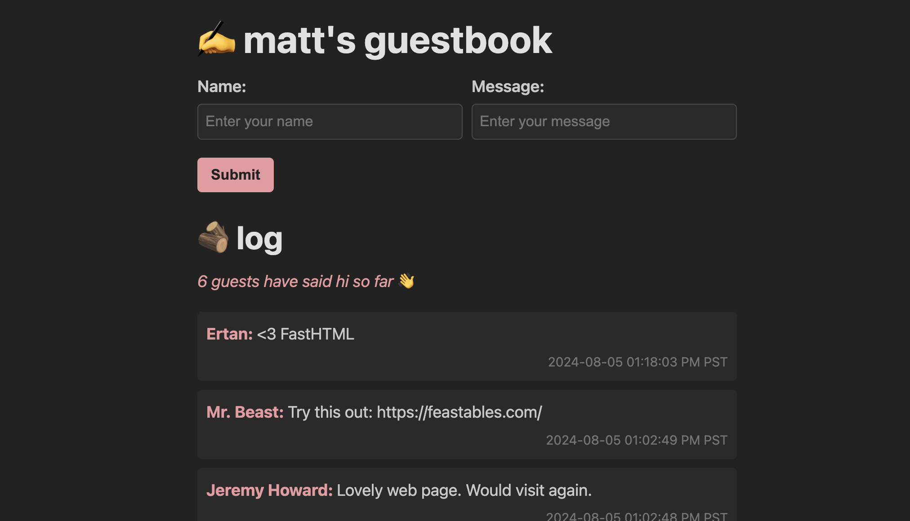

# Matt's Guestbook

A simple, real-time guestbook application built and deployed with:

- [FastHTML](https://fastht.ml): A Python framework for building HTML applications
- [HTMX](https://htmx.org): For seamless AJAX requests and updates

Say hi: [https://guestbook.mattpalmer.io](https://guestbook.mattpalmer.io) or [follow along](https://x.com/mattppal) for more!

  

## Setup

1. Fork the Repo
2. `python main.py`
3. The application will start, and you can access it via the provided URL

That's it!

## Configuration

1. Update the `MAX_NAME_CHAR` and `MAX_MESSAGE_CHAR` constants in `main.py` if you want to change input limits
2. Modify the `TIMESTAMP_FMT` constant to change the timestamp format
3. Adjust the styling in `style.css` to customize the appearance
4. We're currently storing data in SQLite via FastHTML's own interface. For persistent data, you'll need to modify the db or deploy it somewhere. [Here's](https://github.com/mattppal/replit-fasthtml-guestbook) an example doing so with Replit.